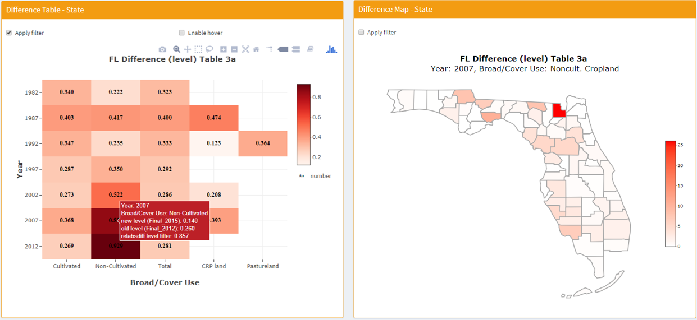

## Introduction

This repository contains the R Shiny codes used to develop an interactive web tool called **iNtr** aiming for **i**nteractive **N**atural Resources Inventory (NRI) **t**able **r**eview. To avoid violating the privacy policy of the NRI, we are here presenting a modified version of the tool based on the USDA released 2015 and 2012 NRI estimation results.  

This tool is lively hosted at [https://lyux.shinyapps.io/table_review/](https://lyux.shinyapps.io/table_review/).

## Background

Many statistical agencies like the [Center of the Survey Statistics and Methodology at the Iowa State University](https://www.cssm.iastate.edu/) that work on large data operations suffer from labor-intensive review of data products. Tool like **iNtr** can help reduce cognitive load in this iterative process and boost review efficiency. Specifically, this tool allows to highlight and trace down "bad" difference (between two different computer program runs) from national level to state level then to county level (not shown in this public version).

## Demo

The following image from screen-capturing of **iNtr** shows the link between state level difference table of estimations and county level difference map. The county with the reddest color contributes the most to the clicked cell in the state-level difference table.

## Reference

For more information, please refer to the [presentation](https://www.niss.org/sites/default/files/3.%20ITSEW2019%20Session%205%20-%20Lyu%20et%20al.pdf) I gave at the [2019 International Total Survey Error Workshop](https://dsaemq.unibg.it/it/itsew2019) hosted in Bergamo, Italy.
